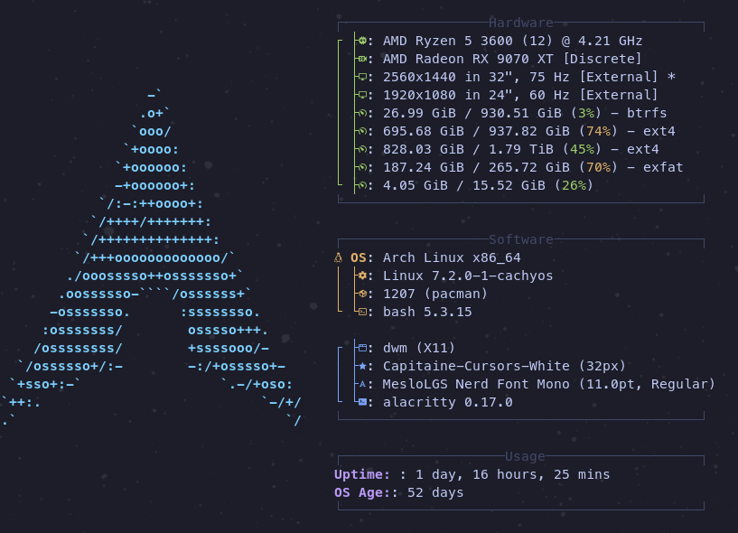
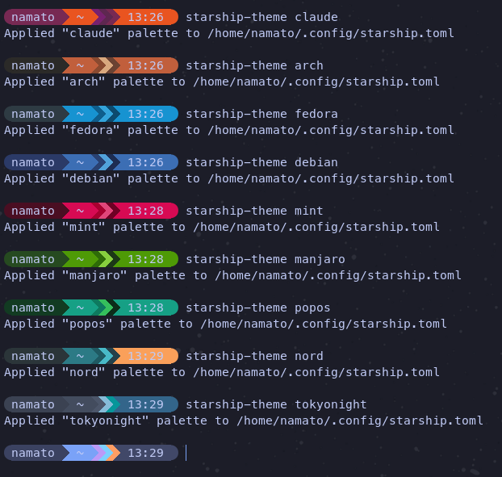

# TechNicks' `.bashrc` Configuration (Linux/macOS)



## Overview

mybash is a batteries-included `.bashrc` configuration plus the supporting scripts and config files needed to set it up. It configures the shell session with aliases, functions, a Starship prompt, fastfetch, fzf, and zoxide, turning a stock Bash into a considerably more usable terminal on Linux and macOS.

## Table of Contents

- [Requirements](#requirements)
- [Installation](#installation)
- [What Gets Installed Where](#what-gets-installed-where)
- [Switching Color Palettes](#switching-color-palettes)
- [Uninstallation](#uninstallation)
- [Configuration Files](#configuration-files)
  - [.bashrc](#bashrc)
  - [starship.toml](#starshiptoml)
  - [starship-theme](#starship-theme-1)
  - [config.jsonc](#configjsonc)
- [Key Features](#key-features)
- [Functions Reference](#functions-reference)
- [System-Specific Configurations](#system-specific-configurations)

## Requirements

- **Linux** with one of: `nala`, `apt-get`, `dnf`, `yum`, `pacman`, `zypper`, `emerge`, `xbps-install`, or `nix-env`, plus `sudo` (or `doas`) for package installation, **or**
- **macOS**, where the installer will bootstrap Homebrew if it is missing
- `curl` and `git`
- A terminal that can render Nerd Font glyphs (the installer sets this up where it can)

## Installation

```sh
git clone --depth=1 https://github.com/technicks89/mybash.git
cd mybash
./setup.sh
```

`setup.sh` automates the whole process:

- Installs dependencies with your system package manager: `bash-completion`, `bat`, `tree`, `multitail`, `fastfetch`, `neovim`, `trash-cli`, `fzf`, `zoxide`, plus `curl`, `fontconfig`, `tar`, and `xz` on Linux
- On macOS: installs Homebrew if missing, installs Bash 5 (`bash`) and `bash-completion@2`, `starship`, and the `font-meslo-lg-nerd-font` cask, adds Homebrew Bash to `/etc/shells`, and sets it as your login shell
- On Linux: installs Starship into `~/.local/bin` via the official installer, and installs JetBrainsMono Nerd Font into `~/.local/share/fonts`
- Copies the repository files into `~/.local/share/mybash`
- Symlinks the configs into place (see below)
- Selects the Nerd Font in Ptyxis or GNOME Terminal when either is detected, backing up the previous font settings first
- Ensures `~/.bash_profile` initializes Homebrew and sources `~/.bashrc` on macOS

On macOS, `setup.sh` prompts for your password when it adds Homebrew Bash to `/etc/shells` and changes your default shell. Restart Terminal afterwards, then verify:

```sh
echo "$SHELL"
bash --version
```

`$SHELL` should point at the Homebrew Bash path — `/opt/homebrew/bin/bash` on Apple Silicon, `/usr/local/bin/bash` on Intel.

## What Gets Installed Where

The repository files are copied into `~/.local/share/mybash`, and the following symlinks point back at that directory:

| Symlink | Target |
| --- | --- |
| `~/.bashrc` | `~/.local/share/mybash/.bashrc` |
| `~/.config/starship.toml` | `~/.local/share/mybash/starship.toml` |
| `~/.config/fastfetch/config.jsonc` | `~/.local/share/mybash/config.jsonc` |
| `~/.local/bin/starship-theme` | `~/.local/share/mybash/starship-theme` |

Any pre-existing file at one of those paths is moved aside to `<path>.bak.<timestamp>` before the symlink is created.

Because `starship-theme` is linked into `~/.local/bin`, that directory has to be on your `PATH` for the command to be found. The bundled `.bashrc` adds it automatically; if `starship-theme` reports "command not found" after installing, open a new shell or check `echo "$PATH"`.

## Switching Color Palettes

Use `starship-theme` to recolor the prompt without changing its layout:

```bash
starship-theme          # interactive picker (uses fzf when available)
starship-theme arch     # apply a palette directly
starship-theme list     # list available palettes
```

Available palettes: `ubuntu`, `claude`, `arch`, `fedora`, `debian`, `mint`, `manjaro`, `popos`, `kali`, `gentoo`, `dracula`, `tokyonight`, and `nord` (the original theme).



The script rewrites the six color slots in a pristine copy of `starship.toml` and writes the result to your live config. Two environment variables adjust that:

- `STARSHIP_CONFIG` — where the recolored config is written (default `~/.config/starship.toml`)
- `STARSHIP_THEME_BASE` — the pristine `starship.toml` to recolor. If unset, the script looks next to itself, then falls back to `~/.local/share/mybash/starship.toml`

Palettes are applied to the generated config, not stacked, so switching palettes repeatedly always starts from the pristine base.

## Uninstallation

```sh
cd mybash
./uninstall.sh              # remove configuration and installed software
./uninstall.sh --keep-deps  # remove configuration only, keep software and fonts
```

`uninstall.sh` reverses the installation:

- Removes the installed dependencies and the Nerd Fonts (unless `--keep-deps` is passed)
- Removes `starship`, `fzf`, and `zoxide`
- Removes the symlinked configs, including `~/.local/bin/starship-theme`
- Restores the newest `~/.bashrc.bak.*` backup created during installation
- Restores the previous Ptyxis or GNOME Terminal font settings
- Deletes the data directory

Restart your shell afterwards.

## Configuration Files

### `.bashrc`

Defines the aliases, functions, and environment variables that make up the shell experience. Highlights:

- **Safer defaults**: `cp` and `mv` prompt before clobbering, `mkdir` implies `-p`, and `rm` is remapped to `trash-put`, `trash`, or `gio trash` when available so deletions are recoverable
- **Editor detection**: prefers `nano`, falling back to `nvim`, then `vim`, then `vi`, exporting `EDITOR`/`VISUAL`. When `nvim` is the one selected, `vi` and `vim` are aliased to it
- **History management**: `PROMPT_COMMAND` appends and reloads history so it is shared across concurrent sessions, with `HISTCONTROL=erasedups:ignoredups:ignorespace` to drop duplicates
- **Navigation**: `..` through `.....`, `bd` to jump back, `up N` to climb N directories, and an `ls` after every `cd`
- **Integrations**: `fastfetch` on shell start, `starship init bash`, `zoxide init bash`, and <kbd>Ctrl</kbd>+<kbd>f</kbd> bound to `zi` for interactive directory jumping
- **Package-manager fzf helpers**: `yayf`/`yayr` on Arch, `dnff`/`dnfr` on Fedora, for fuzzy install and removal with package previews

### `starship.toml`

Configures the [Starship](https://starship.rs/) prompt — a single-line powerline layout with segments for the virtualenv, username, directory, git branch and status, language versions (C, Elixir, Elm, Go, Haskell, Java, Julia, Node, Nim, Rust), Docker context, and the time. Directory names like `Documents` and `Downloads` are substituted with Nerd Font glyphs.

### `starship-theme`

A small Bash script that recolors `starship.toml`. See [Switching Color Palettes](#switching-color-palettes).

### `config.jsonc`

Configures [fastfetch](https://github.com/fastfetch-cli/fastfetch), the system information tool that runs at shell start. It sets the logo and separator styling and defines which modules are shown — CPU, GPU, OS, kernel, uptime, and custom hardware and software sections.

## Key Features

1. **Aliases and Functions** — shortcuts for common commands, plus functions for archive extraction, copying with progress, and recursive text search
2. **Prompt and History** — Starship prompt with switchable palettes, automatic cross-session history saving, duplicate suppression
3. **Safer File Operations** — interactive `cp`/`mv`, trash-backed `rm`, and `rmd` kept available for genuinely destructive recursive deletes
4. **Colorized Output** — `LS_COLORS`, `CLICOLOR`, colored `grep`, `less -R`
5. **Directory Navigation** — Zoxide with an fzf-driven picker on <kbd>Ctrl</kbd>+<kbd>f</kbd>

## Functions Reference

| Function | Description |
| --- | --- |
| `extract <file>` | Extract any common archive format |
| `ftext <string>` | Recursively grep for text under the current directory |
| `cpp <src> <dst>` | Copy with a progress bar |
| `cpg` / `mvg` | Copy or move, then `cd` into the destination |
| `mkdirg <dir>` | Create a directory and `cd` into it |
| `up <n>` | Move up `n` directory levels |
| `countfiles` | Count files, links, and directories in the current directory |
| `ver` | Show the OS and version |
| `distribution` | Detect the running Linux distribution |
| `trim <string>` | Strip leading and trailing whitespace |
| `gcom "<msg>"` | `git add .` and commit |
| `lazyg "<msg>"` | `git add .`, commit, and push |
| `ebrc` | Open `~/.bashrc` in your editor |
| `sedit` / `svi` | Edit a file as root with your editor |
| `hlp` | Page `~/.bashrc_help` if present |
| `apacheconfig` / `phpconfig` / `mysqlconfig` | Open the relevant service config, searching the usual locations |
| `apachelog` | Tail the Apache access and error logs |
| `install_bashrc_support` | Install the supporting utilities for the current distro |

## System-Specific Configurations

- macOS prepends the Homebrew and `trash` paths, and sources Homebrew's `bash_completion` with a compatibility shim for Bash 3.2
- Linux sources the system `bash_completion` and installs Starship into `~/.local/bin`
- `rm`, package-manager, and terminal-font aliases are all defined conditionally on what is actually present

---

For issues, suggestions, or contributions, please open an issue or pull request. Community involvement is welcome.
